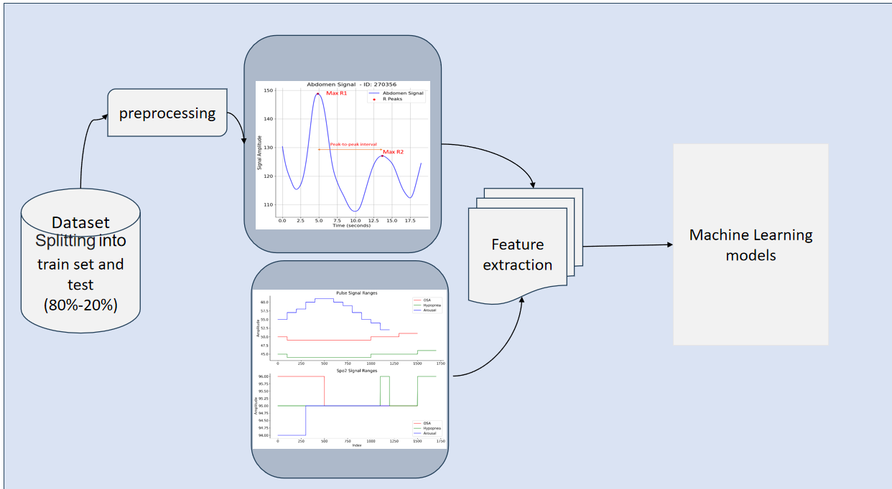

As a student deeply passionate about the field of Artificial Intelligence, I have a particular focus on Deep Learning and Machine Learning, with a strong interest in their applications in Bio-signal Processing and Bio-inspired Computing. I am currently in the 4th semester of my master’s program at Sharif University in Iran.

<h3>Ongoing Projects</h3>

  

    <h4>Sleep Disorders Diagnosis Using Biosignals and Machine Learning</h4>
    
<strong>Description:</strong> Another ongoing project involves the diagnosis of sleep disorders using biosignals and machine learning techniques. Sleep disorders can have a significant impact on an individual's health and quality of life. This project aims to develop algorithms and models that can analyze biosignals to detect and diagnose various sleep disorders, facilitating early intervention and treatment.

    
  

<h3>Thesis Title</h3>

Analysis of Sensory Data in Apnea Patients to Aid in Heterogeneous Control of Breathing Aid Pumps

<h3>Thesis Description</h3>

My Master's thesis, conducted at Sharif University of Technology in Tehran, Iran, under the guidance of Dr. Jahed and Dr. Khalaj, is centered around the critical area of improving treatment for apnea patients. This research endeavors to enhance the care and management of apnea patients through a multidisciplinary approach that merges biomedical engineering with artificial intelligence (AI) methodologies.

The project commenced in July 2022 and is currently ongoing. The primary objectives and achievements include:

<ul>
  <li>Literature Review: A comprehensive literature review was conducted to explore existing data analysis techniques, with a specific focus on classification and signal processing methods. This served as the foundation for designing an innovative treatment approach for apnea patients using AI.</li>
  
  <li>Data Preprocessing: Robust data preprocessing techniques were developed and implemented to enhance the quality of sensory data. This included removing noise, eliminating artifacts, and applying wavelet decomposition to various physiological signals, such as ECG, EEG, Abdomen effort, Thorax effort, and Chin-EMG.</li>
  
  <li>Machine Learning and Deep Learning: Advanced machine learning and deep learning models were employed to extract relevant features from respiratory signals. These features were utilized to classify sleep events within diverse groups of apnea patients, contributing to the development of personalized treatment strategies.</li>
  
  <li>EEG Preprocessing: The Highly Automated Preprocessing Pipeline for EEG (HAPPE) was employed to preprocess EEG data. This step was crucial in ensuring the accuracy and reliability of EEG-derived insights for further analysis and treatment planning.</li>
</ul>

In summary, this research project at Sharif University of Technology represents a significant effort to improve the management of apnea patients by harnessing the power of data analysis and AI-driven insights. It aims to pave the way for more effective and personalized control of breathing aid pumps, ultimately enhancing the quality of life for individuals affected by apnea.

