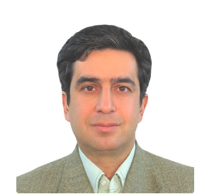

Dr. Mehran Jahed completed his EE Bachelor's degree in EE in 1982, at Purdue University, West Lafayette, IN, and his Masters's and Ph.D. in EE in 1987 and 1990, at the University of Kentucky. He was a post-doctoral fellow at the Center for Excellence for Biomedical Engineering at the University of Kentucky from 1990 to 1993. Since 1993 he has been a faculty member of the EE department at Sharif University of Technology. His research interests are in biomedical modeling and control, bio-robotics and prosthetic systems, virtual and augmented reality, and the application of artificial intelligence in medicine and biology.

<h3>Research Interests</h3>
<ul>
  <li>Physiological Systems Modeling and Control</li>
  <li>Bio-robotics and Prosthetic Devices</li>
  <li>Machine Vision</li>
  <li>Application of Artificial Intelligence in Medicine</li>
  <li>Ultrasound and MRI Systems</li>
</ul>

<h3>Courses Taught</h3>

<strong>Biomedical:</strong>

<ul>
  <li>Biological Systems Modeling</li>
  <li>MRI Systems</li>
  <li>Bioinstrumentations</li>
  <li>Advanced Bioinstrumentations</li>
  <li>Control of Physiological Systems</li>
  <li>Modeling and Control of Neuromuscular Systems</li>
  <li>Medical Imaging Systems</li>
</ul>

<strong>Digital and Control Systems:</strong>

<ul>
  <li>Robotics</li>
  <li>Machine Vision</li>
  <li>Computer Architecture</li>
  <li>Microprocessor I</li>
  <li>Microprocessor Interfacing Circuits</li>
  <li>Industrial Electronics</li>
  <li>Fundamentals of Electromechanical Machines</li>
  <li>Industrial Control</li>
</ul>

You can see my publications in here :[Google scholar]([https://manoa.hawaii.edu/news/article.php?aId=2857](https://scholar.google.com/citations?user=g4iOgRsAAAAJ&hl=en)https://scholar.google.com/citations?user=g4iOgRsAAAAJ&hl=en).
